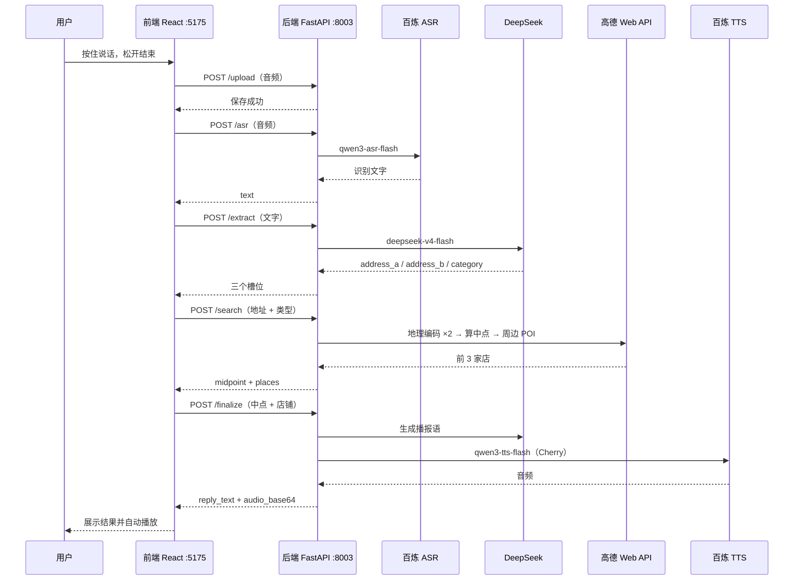

# 语音约碰面地点助手

说一句话，帮你和朋友找中间的碰面地点。

对着网页按住说话，例如：「我在杭州东站，朋友在蒋村地铁站，在哪碰面合适？」松开后，系统自动完成语音识别、地址提取、中点计算与周边店铺搜索，并生成语音播报推荐结果。

## 链路示意图



## 技术栈

| 层级 | 技术 |
|------|------|
| 前端 | React、Vite、Axios、MediaRecorder API |
| 后端 | Python、FastAPI、uvicorn、httpx、aiofiles、python-dotenv |
| 语音识别 | 阿里百炼 `qwen3-asr-flash` |
| 信息提取 / 播报语 | DeepSeek `deepseek-v4-flash` |
| 地图 | 高德 Web 服务 REST API（地理编码、周边搜索） |
| 语音合成 | 阿里百炼 `qwen3-tts-flash`（音色 Cherry） |

## 本地运行

### 1. 后端

```bash
cd backend

# 创建并激活虚拟环境（Mac / Linux）
python3 -m venv .venv
source .venv/bin/activate

# Windows PowerShell
# python -m venv .venv
# .\.venv\Scripts\Activate.ps1

# 安装依赖
pip install -r requirements.txt

# 配置环境变量（见下文）
cp .env.example .env
# 编辑 .env，填入各 API Key

# 启动（端口 8003）
uvicorn main:app --reload --port 8003
```

验证：http://localhost:8003/ 、http://localhost:8003/docs

### 2. 前端

```bash
cd frontend

npm install
npm run dev
```

浏览器打开：http://localhost:5175

> 麦克风需在 `localhost` 或 HTTPS 环境下使用；前后端需同时运行。

## 环境变量

在 `backend/.env` 中配置（**仅本地填写，勿提交 Git**）：

```env
BAILIAN_API_KEY=your_bailian_api_key_here
DEEPSEEK_API_KEY=your_deepseek_api_key_here
AMAP_API_KEY=your_amap_api_key_here
DEBUG=true
BACKEND_PORT=8003
```

| 变量 | 用途 |
|------|------|
| `BAILIAN_API_KEY` | 百炼 ASR + TTS |
| `DEEPSEEK_API_KEY` | 地址提取、播报语生成 |
| `AMAP_API_KEY` | 高德地理编码与 POI 搜索 |
| `DEBUG` | 开发模式开关（预留） |
| `BACKEND_PORT` | 文档参考，实际由 uvicorn 命令行指定 |

## API 一览

| 方法 | 路径 | 说明 |
|------|------|------|
| POST | `/upload` | 上传录音 |
| POST | `/asr` | 语音转文字 |
| POST | `/extract` | 提取地址与碰面类型 |
| POST | `/search` | 算中点并搜周边 POI（前 3 条） |
| POST | `/finalize` | 生成播报语 + TTS 音频 |

## 已知限制

- **中点算法**：两坐标算术平均，未考虑路网；中点可能落在水域等非 POI 区域，靠扩大搜索半径兜底。
- **地址歧义**：口语化站名、地铁口可能地理编码失败或偏移，需用户换说法重试。
- **音频格式**：浏览器录音多为 `webm`，依赖百炼 ASR 对格式的支持。
- **无地图展示**：仅文字 + 语音结果，不做地图标点。
- **失败无文字输入降级**：任一步失败即返回友好提示，不支持手动改文字重试。
- **TTS 音频 URL**：百炼返回的临时 URL 有效期约 24 小时；当前以 base64 内联返回前端播放。
- **网络环境**：GitHub 推送建议使用 SSH；部分环境下 HTTPS 443 可能不可用。

## 下一步计划

- [ ] 增加 `POST /meetup` 一键流水线接口，减少前端多次往返
- [ ] 中点策略可选：按路程平分 / 地铁可达性加权
- [ ] 前端展示简易地图与中点、店铺标点
- [ ] 生产部署：HTTPS、环境变量托管、CORS 白名单收紧
- [ ] 错误重试与录音重说 UX 优化

## 项目结构

```
03_audio/
├── README.md
├── backend/
│   ├── main.py              # FastAPI 入口
│   ├── config.py            # 只读 backend/.env
│   ├── requirements.txt
│   ├── .env.example
│   ├── schemas/             # 请求/响应模型
│   └── services/            # ASR、Extract、高德、Finalize
└── frontend/
    ├── src/App.jsx          # 录音、上传、展示、播放
    └── vite.config.js       # 端口 5175
```
